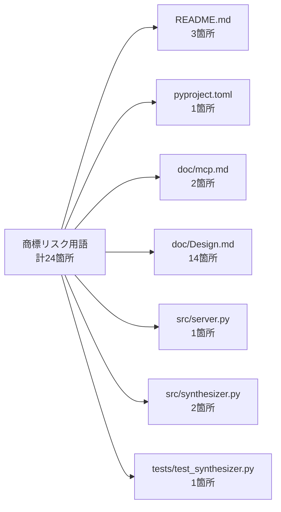

# 商標リスク用語 置き換え対応計画

> 作成日: 2026-07-11 | ステータス: **計画中**

## 1. 背景・目的

GitHub公開にあたり、任天堂の登録商標（ファミコン、Famicom、NES、FC等）がドキュメント・ソースコードに含まれている。商標権侵害のリスクを排除するため、これらの用語を商標問題のない汎用的な表現に置き換える。

## 2. 置き換えマッピング

### 2.1 高リスク用語（置き換え対象）

| 現在の用語 | 置き換え後 | リスク分類 |
|-----------|-----------|-----------|
| ファミコン音源 | レトロチップ音源 | 任天堂登録商標「ファミコン」 |
| ファミコン音源風 | レトロチップ音源風 | 同上 |
| ファミコン（NES） | レトロチップ音源（2A03 APU） | 同上 |
| ファミコン音源作曲MCPサーバ | レトロチップ音源作曲MCPサーバ | 同上 |
| Famicom-style | retro chiptune-style | 任天堂登録商標「Famicom」 |
| Famicom | retro chiptune | 同上 |
| NES APU | レトロAPU | 任天堂登録商標「NES」 |
| NES APU風 | レトロAPU風 | 同上 |
| NES APU-style | retro APU-style | 同上 |
| NES noise | retro noise | 同上 |
| NES非線形ミキシング | レトロAPU非線形ミキシング | 同上 |
| NES APU 4チャンネル | レトロAPU 4チャンネル | 同上 |
| NES APUハードウェア仕様 | レトロAPUハードウェア仕様 | 同上 |
| FC準拠 | クラシックAPU準拠 | 任天堂登録商標「FC」（Family Computer略称） |
| FC実機風 | クラシックAPU実機風 | 同上 |
| FC音源 | クラシックAPU音源 | 同上 |

### 2.2 低リスク用語（置き換え不要）

| 用語 | 理由 |
|------|------|
| 2A03 | Ricoh製チップのハードウェア型番。商標ではなく部品番号 |
| PPMCK | オープンソースのMMLコンパイラ名 |
| Pyxel | オープンソースのPythonゲームエンジン名 |
| DPCM | 汎用技術用語（Differential Pulse Code Modulation） |
| NSF | 汎用フォーマット名（NES Sound Format）※「NES」を含むが略語として定着 |

> **注記:** NSFは「NES Sound Format」の略だが、ファイルフォーマット名として独自名詞的に定着している。第2段階の将来機能であり現状は未実装のため、今回は置き換え不要と判断。必要に応じて別途検討。

## 3. 影響範囲

### 3.1 ファイル別出現箇所

### 3.2 詳細出現リスト

#### README.md（3箇所）

| 行 | 現在 | 置き換え後 |
|----|------|-----------|
| 3 | `ファミコン音源（2A03 APU）風のMML` | `レトロチップ音源（2A03 APU）風のMML` |
| 27 | `NES APU風の矩形波/三角波/ノイズ` | `レトロAPU風の矩形波/三角波/ノイズ` |
| 35 | `PPMCKインスパイアのFC準拠形式` | `PPMCKインスパイアのクラシックAPU準拠形式` |

#### pyproject.toml（1箇所）

| 行 | 現在 | 置き換え後 |
|----|------|-----------|
| 4 | `Famicom-style MML composition` | `retro chiptune-style MML composition` |

#### doc/mcp.md（2箇所）

| 行 | 現在 | 置き換え後 |
|----|------|-----------|
| 9 | `ファミコン音源風MMLの解析・合成` | `レトロチップ音源風MMLの解析・合成` |
| 17 | `MMLをNES APU風音源で合成し` | `MMLをレトロAPU風音源で合成し` |

#### doc/Design.md（14箇所）

| 行 | 現在 | 置き換え後 |
|----|------|-----------|
| 1 | `ファミコン音源作曲MCPサーバ` | `レトロチップ音源作曲MCPサーバ` |
| 11 | `ファミコン（NES）のAPU音源` | `レトロチップ音源（2A03 APU）のAPU音源` |
| 18 | `FC準拠` | `クラシックAPU準拠` |
| 19 | `NES APU 4チャンネル` | `レトロAPU 4チャンネル` |
| 28 | `FC実機風非線形ミキシング` | `クラシックAPU実機風非線形ミキシング` |
| 473 | `NES APU ハードウェア仕様` | `レトロAPU ハードウェア仕様` |
| 538 | `NES非線形ミキシングテーブル` | `レトロAPU非線形ミキシングテーブル` |
| 547 | `NES非線形ミキシング` | `レトロAPU非線形ミキシング` |
| 559 | `FC音源の主要機能` | `クラシックAPU音源の主要機能` |
| 567 | `NES APUハードウェア仕様` | `レトロAPUハードウェア仕様` |
| 568 | `NES APU仕様` | `レトロAPU仕様` |
| 634 | `FC準拠` | `クラシックAPU準拠` |
| 888 | `FC準拠` | `クラシックAPU準拠` |
| 966 | `ファミコン音源作曲MCPサーバ` | `レトロチップ音源作曲MCPサーバ` |

#### src/mml_composemusic_mcp/server.py（1箇所）

| 行 | 現在 | 置き換え後 |
|----|------|-----------|
| 59 | `Famicom-style MML` | `retro chiptune-style MML` |

#### src/mml_composemusic_mcp/synthesizer.py（2箇所）

| 行 | 現在 | 置き換え後 |
|----|------|-----------|
| 1 | `NES APU-style synthesizer` | `retro APU-style synthesizer` |
| 29 | `NES noise: rate = ...` | `retro noise: rate = ...` |

#### tests/test_synthesizer.py（1箇所）

| 行 | 現在 | 置き換え後 |
|----|------|-----------|
| 1 | `NES APU synthesizer engine` | `retro APU synthesizer engine` |

## 4. 実行ステップ

### Step 1: ドキュメント類の置き換え
1. `README.md` — 3箇所
2. `doc/mcp.md` — 2箇所
3. `doc/Design.md` — 14箇所

### Step 2: 設定ファイルの置き換え
4. `pyproject.toml` — 1箇所

### Step 3: ソースコードの置き換え
5. `src/mml_composemusic_mcp/server.py` — 1箇所（docstring）
6. `src/mml_composemusic_mcp/synthesizer.py` — 2箇所（docstring + コメント）

### Step 4: テストコードの置き換え
7. `tests/test_synthesizer.py` — 1箇所（docstring）

### Step 5: 検証
8. テスト実行: `uv run pytest` で回帰確認
9. 最終検索: `ファミコン|Famicom|NES|FC準拠|FC実機|FC音源` で残存0件を確認

## 5. 注意事項

- **コードロジックへの影響なし**: すべての置き換えは docstring・コメント・ドキュメント内の文字列のみ。実行ロジックには影響しない。
- **API互換性維持**: `mode` パラメータの値（`ppmck`/`pyxel`）は変更しない。ユーザ向けIFはそのまま。
- **2A03は保持**: チップ型番「2A03」は商標ではないため、技術仕様の補足として残す。
- **外部URLは変更しない**: 参考文献のGitHub URL（midi2nes, nes-specs等）は外部リソースへのリンクであり、プロジェクト自身の商標使用ではないため変更不要。